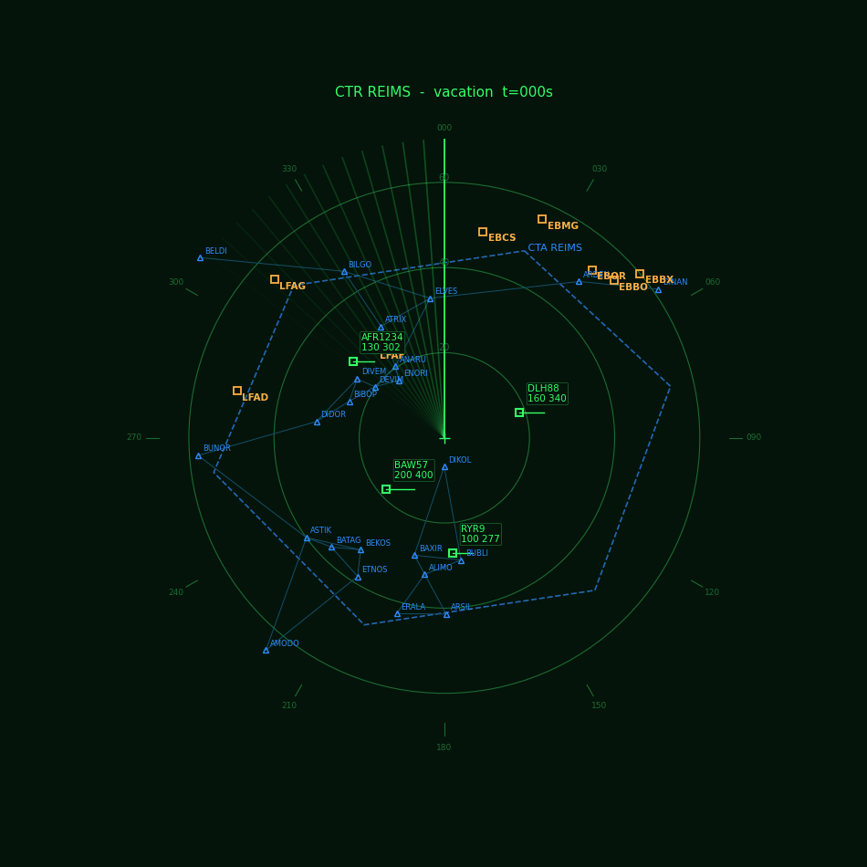
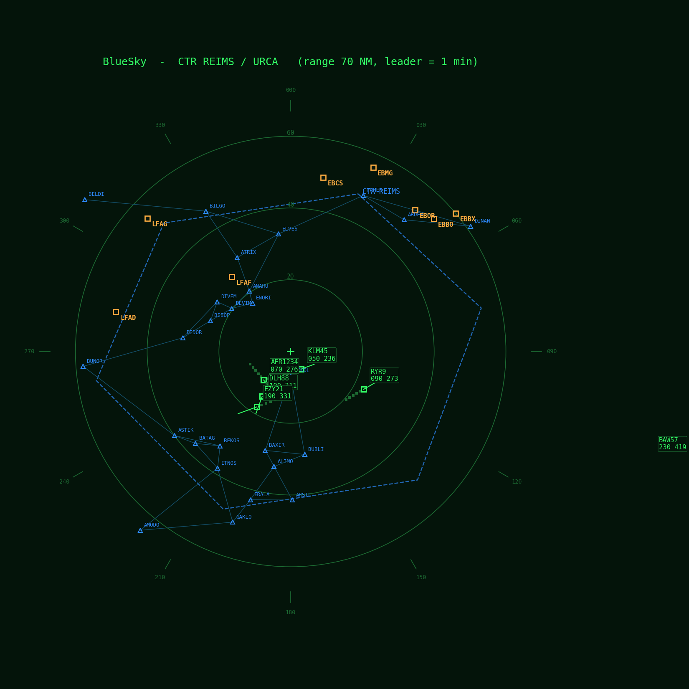
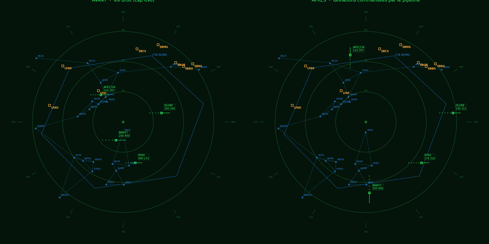
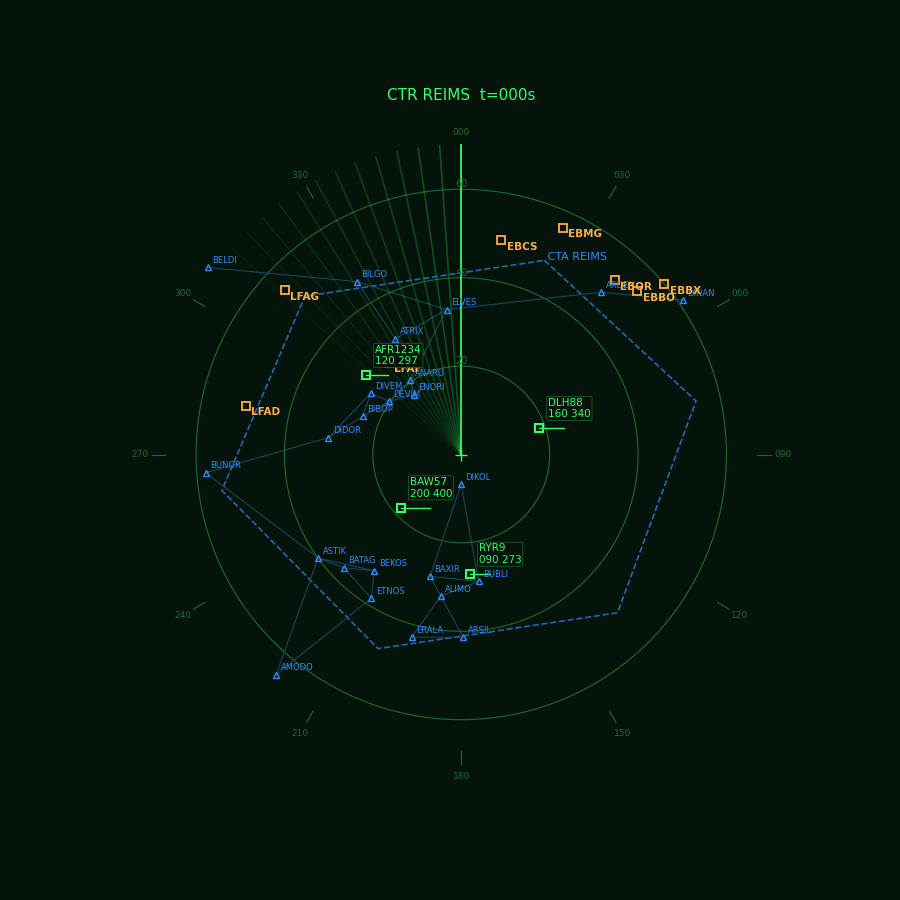
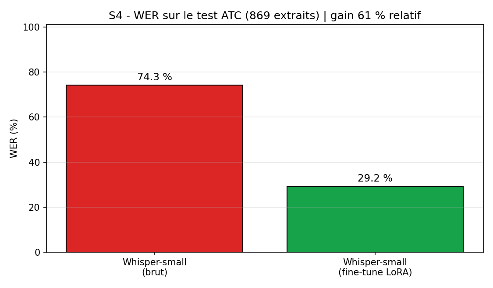
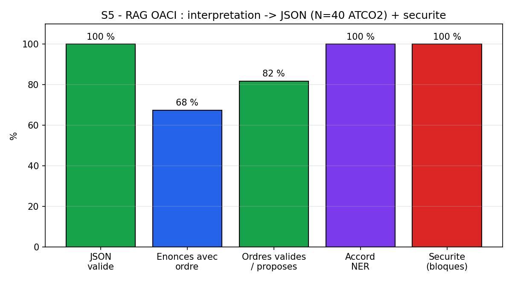
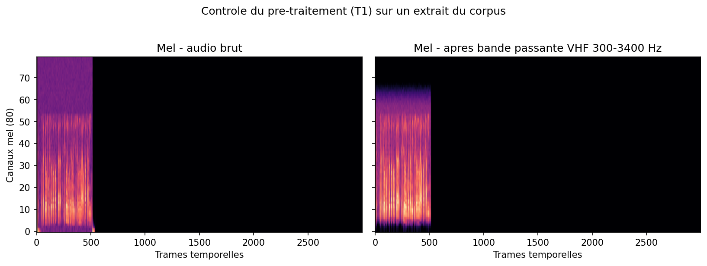

# Simulateur Controleur Aerien

### An AI co-pilot for air traffic control: from pilot speech to simulator action, and back to voice


A proof of concept that automates the pilot and controller radio dialogue inside an air traffic
simulator. A spoken instruction is transcribed, grounded in ICAO phraseology, turned into a
validated command, executed in the BlueSky simulator, and answered by a synthesized pilot readback
voice. The full chain runs as a real time loop, with the AI models hosted on a GPU cluster and the
simulator running on a local machine.



> Internship project (10 week PoC), University of Reims Champagne-Ardenne (URCA). AI compute on the
> ROMEO supercomputer (NVIDIA GH200, Grace-Hopper, aarch64). Author: Nicolas Marano.

---

## Table of contents

1. [What it does](#what-it-does)
2. [Architecture](#architecture)
3. [Key results](#key-results)
4. [Demos](#demos)
5. [Pipeline stages](#pipeline-stages)
6. [How to run](#how-to-run)
7. [Repository layout](#repository-layout)
8. [Tech stack](#tech-stack)
9. [Status and roadmap](#status-and-roadmap)
10. [Limitations](#limitations)
11. [License and acknowledgements](#license-and-acknowledgements)

---

## What it does

The target pipeline closes a full voice loop between a pilot, an AI controller, and a traffic
simulator:

```
pilot voice (VHF) -> Whisper STT -> NER + LLM with RAG (ICAO Doc 4444) -> validated JSON
                  -> BlueSky simulator (aircraft maneuver) -> synthesized pilot readback voice -> loop
```

Every brick is trained or grounded on its own, then assembled:

- Speech recognition is a Whisper model fine tuned on real, noisy air traffic control audio.
- The reasoning layer is a local LLM grounded by retrieval in a phraseology knowledge base, and by a
  graph model of the airspace sector. It outputs a strict JSON command and refuses unsafe orders.
- The command is executed in BlueSky, a research air traffic simulator, which moves the aircraft.
- The aircraft answers with a readback, synthesized in a cloned pilot voice and degraded to sound
  like a real VHF radio.

## Architecture

The AI models stay on the GPU cluster, the simulator runs on the local PC, and the two sides are
linked by an SSH tunnel. This mirrors a realistic split between a heavy compute backend and a light
operational frontend.

```
        LOCAL PC (Windows, Python 3.12)                 ROMEO cluster (armgpu node, GH200)
  +------------------------------------+   SSH tunnel   +-----------------------------------+
  | pipeline orchestrator              |  ===========>  | FastAPI inference server          |
  |   + BlueSky simulator (headless)   |  /asr /interpret  ASR  : fine tuned Whisper (GPU)  |
  |   executes TrafScript, reads state |  <-- JSON ----    LLM  : Mistral 7B + RAG + graph  |
  |   renders the radar scope          |  /tts (text)  ->  TTS  : XTTS voice cloning (CPU)  |
  +------------------------------------+  <-- wav -----  +-----------------------------------+
```

## Key results

| Brick | Metric | Result |
|---|---|---|
| Whisper fine tuning (S4) | WER on ATCO2 test, zero shot to fine tuned | 74.3% to 29.2% (about 60% relative) |
| Whisper fine tuning (S4) | Validation WER (UWB + ATCOSIM), 3 epochs | 6.68% |
| RAG to JSON (S5) | Parseable JSON on 40 real transcriptions | 100% |
| RAG to JSON (S5) | Valid orders among proposed | 27 / 33 (81.8%) |
| Safety (S5) | Out of bounds or unknown orders blocked | 5 / 5 (100%) |
| Sector graph (S5) | Shortest path ENTRY_W to EXIT_E | 101 NM, ADDWPT validated against sector fixes |
| Voice loop (S6 + S8) | Re-transcription WER of the synthesized voice | about 22 to 24% |
| Live interaction (S8) | Aircraft maneuver on spoken instruction | confirmed (heading and level changes in BlueSky) |

## Demos

### Realistic radar scope, built from the simulator data

A controller style radar scope rendered from the real BlueSky simulation state and the real
navigation database (waypoints, airports), centered on the Reims sector. Aircraft show a velocity
leader and a data block (callsign, flight level, ground speed).



### Live interaction: spoken instructions deviate the aircraft

Four aircraft fly straight (heading 090). Natural language instructions are sent through the
pipeline and the aircraft deviate. Left: before. Right: after the pipeline commands.



Animated replay with the rotating radar sweep:



### Whisper fine tuning and RAG results

| Whisper WER | RAG and safety | VHF preprocessing |
|---|---|---|
|  |  |  |

### Two way voice (the aircraft talk back)

The controller speaks, the order is executed, then the pilot reads it back in the cloned aircraft
voice over VHF. Listen to the recorded radio exchange: [audio/session_radio.wav](audio/session_radio.wav)
and the per exchange files in [audio/](audio/).

## Pipeline stages

| Stage | What | Key files | Result |
|---|---|---|---|
| Foundations | VHF bandpass, airspace graph, JSON to BlueSky connector, rule based NER | `src/01_..05_`, `src/secteur_graphe.json` | reusable building blocks |
| Whisper fine tuning | LoRA fine tuning of whisper-small on ATC audio, VHF augmentation | `src/06_..10_`, `src/atc_*` | WER 74.3% to 29.2% |
| RAG OACI | phraseology knowledge base, retrieval, Mistral strict JSON, graph validation | `src/11_..16_`, `src/atc_llm.py`, `src/kb_oaci.py`, `src/graph_secteur.py` | 100% valid JSON, 100% unsafe blocked |
| Voice synthesis | XTTS zero shot voice cloning + VHF degradation, pilot readback | `src/tts_atc.py`, `src/readback.py`, `src/make_pilot_voices.py` | intelligible cloned voices |
| BlueSky live | run the simulator, execute TrafScript, read flight state, radar render | `src/bluesky_runtime.py`, `src/radar_*.py` | aircraft maneuver for real |
| Real time link | FastAPI server (ROMEO) + SSH tunnel + local orchestrator | `src/server.py`, `src/tunnel.sh`, `src/pipeline_e2e.py` | full closed loop |

## How to run

The AI side runs on the ROMEO cluster (SLURM), the simulator side runs locally.

### ROMEO (AI server)

```bash
# one time environment setup (Whisper + Mistral + RAG, then XTTS)
sbatch setup_romeo.sh           # base env, fine tuning stack
sbatch setup_rag.sh             # Mistral + embeddings
sbatch setup_tts_romeo.sh       # XTTS voice cloning

# launch the inference server (ASR + LLM on GPU, TTS on CPU)
sbatch job_server.slurm         # prints SERVER_NODE in the log
```

### Local PC (BlueSky + orchestrator)

```bash
bash setup_bluesky_local.sh                  # Python 3.12 venv + bluesky-simulator
bash tunnel.sh <SERVER_NODE>                 # forward ports 8765 and 8766

# demos
bluesky-env/Scripts/python.exe pipeline_e2e.py        # audio -> Whisper -> LLM -> BlueSky
bluesky-env/Scripts/python.exe live_demo.py           # instructions deviate the aircraft
bluesky-env/Scripts/python.exe voice_exchange.py      # controller and pilot radio exchange
bluesky-env/Scripts/python.exe radar_anim.py          # radar scope image + animation
```

Python dependencies are listed in `requirements-romeo.txt` (AI side) and `requirements-local.txt`
(simulator side).

## Repository layout

```
simulateur-controleur-aerien/
  README.md
  LICENSE
  requirements-romeo.txt        AI stack (cluster side)
  requirements-local.txt        BlueSky client (local side)
  docs/assets/                  figures and radar GIFs used in this page
  src/                          all runtime code (flat, see note below)
  model/whisper-lora-adapter/   trained LoRA adapter for whisper-small
  audio/                        recorded radio exchanges (controller and pilot)
```

Note: `src/` is intentionally flat. The reasoning and server modules load sibling files by path
(for example `03_bluesky_connector.py`, `04_ner_extraction.py`, `graph_secteur`, `atc_callsign`,
`atc_asr`, `tts_atc`). Keeping them together preserves these imports and matches the working
directory used on the cluster.

## Tech stack

- Speech recognition: OpenAI Whisper (small), LoRA fine tuning with Hugging Face Transformers and PEFT.
- Reasoning: Mistral 7B Instruct, retrieval with sentence-transformers (bge-small), numpy cosine search.
- Airspace model: a graph of the sector (nodes, segments, separation), Dijkstra routing.
- Voice synthesis: Coqui XTTS v2 (zero shot voice cloning), VHF bandpass degradation.
- Simulator: BlueSky (TU Delft), headless, driven by TrafScript.
- Serving: FastAPI and Uvicorn, SSH tunnel between the cluster and the local PC.
- Datasets: ATCO2, UWB-ATCC, ATCOSIM (public ATC speech corpora).
- HPC: ROMEO (URCA), NVIDIA GH200 (Grace-Hopper, aarch64), SLURM.

## Status and roadmap

Done: foundations (S1 to S3), Whisper fine tuning (S4), RAG and sector graph (S5), voice synthesis
(S6), BlueSky live and the real time loop (S8), plus the two way voice readback.

Next: unified situation aware query that feeds the live traffic state to the LLM (S7), scripted end
to end scenarios (S9), and a quantitative evaluation over 20 scenarios with a demonstration video (S10).

## Limitations

- Speech recognition can still mishear some callsigns and digit groups on long or noisy utterances.
  An unsafe or unknown order is rejected by the validation layer rather than applied.
- Voice synthesis runs on CPU on the cluster (a known cuFFT issue with torchaudio on the GH200 GPU),
  so it is reliable but not real time fast.

## License and acknowledgements

Released under the MIT License (see `LICENSE`).

This work builds on open research and tools: the ATCO2, UWB-ATCC and ATCOSIM speech corpora, the
BlueSky simulator (TU Delft), OpenAI Whisper, Mistral, Coqui XTTS, and the ICAO radiotelephony
phraseology standards. The phraseology knowledge base is made of concise factual rule cards written
for this project, not a reproduction of any protected document.

Author: Nicolas Marano. Internship in Artificial Intelligence and Air Traffic Control, 2026.
