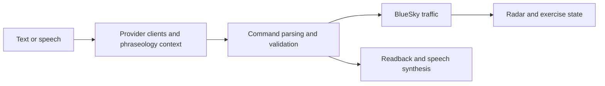
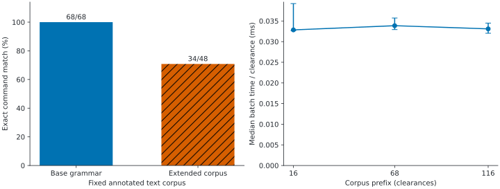
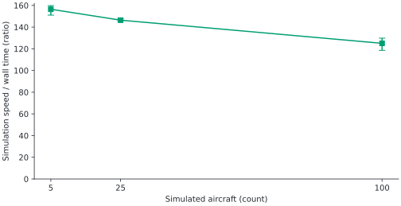

# Air traffic control training simulator

A BlueSky training simulator whose local text parser matches **102 of 116 annotated clearances** in the recorded WSL campaign.

## Abstract

This university internship project connects a training interface, traffic simulation and speech-model services.
The difficult part is preserving callsigns, quantities and intent across the voice-to-command chain.
A local application constructs prompts, validates model output, sends TrafScript commands to BlueSky and builds pilot readbacks.
The new offline campaign measures the existing text parser and local simulation components.
The parser matches all 68 base-grammar examples and 34 of 48 extended examples.
Its failures on the harder corpus, and the absence of a new speech-provider evaluation, limit what these results establish.

## Context and problem

The project was developed at Université de Reims Champagne-Ardenne by Nicolas Marano.
It explores a simulated pilot/controller dialogue and scored training exercises.
A plausible transcript is insufficient: a mistaken callsign, level or heading can turn into the wrong simulator action.
The repository therefore keeps parsing, command validation, traffic execution and readback construction as separate steps.

The current report covers a local WSL replay. Earlier model and cluster experiments remain historical records.
Their figures are not treated as measurements made during this audit.

## Approach


```mermaid
flowchart LR
    A[Text or speech] --> B[Provider clients and phraseology context]
    B --> C[Command parsing and validation]
    C --> D[BlueSky traffic]
    D --> E[Radar and exercise state]
    C --> F[Readback and speech synthesis]
```

The main application consumes speech recognition, language-model and speech-synthesis services through configured APIs.
The offline reference parser, `src/atc_ai.py`, is evaluated directly against the checked-in corpus.
The local conflict detector extrapolates straight-line relative motion; the exercise constructor creates example conflict pairs.
[Design decisions and alternatives](docs/design.md) describe their costs and the boundaries between these components.

## Results

All following results were collected on the machine below. Individual decisions, geometry inputs,
timing samples and source hashes are in [the raw campaign](bench/results/wsl-2026-09-12/).
Tables are derived from [summary.json](bench/results/wsl-2026-09-12/summary.json) by `bench/plot.py`.

| Check | Observed result | Conditions |
|---|---:|---|
| Full text-parser contract | 102 / 116 exact | Fixed annotated corpus; vertical-speed commands included |
| Base grammar | 68 / 68 exact | Development examples |
| Extended corpus | 34 / 48 exact | Paraphrases, transcription-like noise, mixed orders and negative cases |
| Conflict decision vs numerical grid | 0 disagreements / 1,500 cases | Three seeds, straight-line trajectories, equal altitude; only seven positive predictions |
| Constructed conflict examples | 200 / 200 meet the recorded criterion | Seeds 0 through 199; independent relative-motion calculation |
| Local Python suite | 205 tests pass | Pure modules and mocked model-provider calls |

<picture>
  <source media="(prefers-color-scheme: dark)" srcset="docs/assets/local-parser-dark.svg">
  
</picture>

The accuracy bars describe these fixed examples, without a population confidence claim.
Latency uses five batch repetitions after one discarded warmup. Error bars span the first to third quartile.
At a corpus size of 116, the median batch-average cost is **0.03309 ms per clearance**, with an **IQR of 0.00246 ms**.
This excludes speech inference, HTTP transport and simulator execution.

| Simulated aircraft | Median simulation/wall-time ratio | Interquartile range |
|---|---:|---:|
| 5 | 156.45 | 8.82 |
| 25 | 146.39 | 2.20 |
| 100 | 125.03 | 11.26 |

<picture>
  <source media="(prefers-color-scheme: dark)" srcset="docs/assets/local-simulator-dark.svg">
  
</picture>

Each trial advances approximately ten simulated seconds and uses the actual advance returned by the runtime.
A ratio above one means simulation progressed faster than wall time.
Initialization, traffic creation, browser rendering and model services are excluded.
This sweep compares workload sizes within the same simulator; it is not a speedup against another simulator.

| Environment | Recorded value |
|---|---|
| CPU | Intel Core i9-13900H |
| Processors exposed to WSL | 20 logical CPUs; virtual topology is not a count of physical host cores |
| RAM exposed to WSL | 16,537,264,128 bytes |
| System | Ubuntu 24.04.4 LTS, WSL2 kernel 6.6.87.2-microsoft-standard-WSL2 |
| Interpreter | CPython 3.12.3, built with GCC 13.3.0 |
| Compilation options | No project compilation for this Python campaign |
| Library thread limits | OpenMP, OpenBLAS and MKL set to one |
| Main packages | BlueSky 1.1.1, navigation data 1.0.0, OpenAP 2.6.1, NumPy 2.5.3, SciPy 1.18.1, Matplotlib 3.11.2 |
| Configuration | [Pinned BlueSky settings](bench/bluesky.cfg), isolated local working directory |
| Full dependency record | [Environment JSON](bench/results/wsl-2026-09-12/environment.json) and [requirements lock](bench/requirements-wsl.txt) |

## What works

- The parser produces the expected command lists for the cases marked `correct` in [parser_cases.json](bench/results/wsl-2026-09-12/parser_cases.json).
- The sampled geometry comparisons agree under the recorded conditions in [geometry.csv](bench/results/wsl-2026-09-12/geometry.csv).
- Constructed conflict examples satisfy their explicit criteria in [constructed_conflicts.json](bench/results/wsl-2026-09-12/constructed_conflicts.json).
- BlueSky creates the requested traffic and advances simulation time in [bluesky_timing.csv](bench/results/wsl-2026-09-12/bluesky_timing.csv).
- Python checks and the frontend build complete under WSL; see [validation records](docs/results.md#functional-validation).

## What does not work

The parser fails 14 extended cases. [The failure table](docs/results.md#parser-failures)
preserves the expected and actual commands. Missed paraphrases, unsupported wording and partial interpretation
are visible symptoms; extending the grammar requires a separate implementation change and a held-out evaluation.
One of the 24 negative examples produces a command: the French phrase
`AFR1234 monter niveau cinq cents` returns `ALT AFR1234 500` instead of an empty command list.
The mismatch shows that numeric bounds alone do not guarantee correct interpretation of spoken numbers.

The geometry sample contains few predicted conflicts. It cannot establish sensitivity across operational traffic,
turns or altitude changes. The detector rounds displayed closest-approach distance and time.
The largest recorded displayed-distance difference from the fine grid is 0.04746 NM;
the grid and output quantization both limit this comparison.

The BlueSky run reports unavailable RTree helpers and BADA data. The measured path uses OpenAP and completes,
but spatial-index helpers and the BADA performance model were not validated.

Speech recognition, model interpretation, synthesized readbacks and the complete voice loop are **non mesuré**
in this campaign because no corresponding model services were configured.
The frontend build also reports dependency advisories and a large bundle warning; these remain dependency and packaging follow-ups.

Hosted GitHub Actions have not run for this local branch. Their component commands passed under WSL.
The UI bundle must now be built during installation because generated bundles are excluded from version control.

## Limits and scope

The text corpus is hand-authored and partly used during development.
The combined score does not measure spontaneous speech understanding.
The earlier LLM experiment filters vertical-speed commands, so its score uses a different contract.

The geometry uses equal-altitude, constant-velocity cases and a finite numerical grid.
The simulator timings cover one local process and short synthetic traffic runs.
They do not establish concurrent-session capacity, human usability, model quality or operational ATC suitability.
The WSL host, thermal state and virtualization can affect timing.

## Reproducibility

Use the overhaul branch until its pull request is merged:

```bash
git clone --branch chore/repo-overhaul https://github.com/Gotman08/simulateur-controleur-aerien.git
cd simulateur-controleur-aerien
python3.12 -m venv .venv-bench
source .venv-bench/bin/activate
python -m pip install -r bench/requirements-wsl.txt
bash bench/run.sh
python bench/plot.py --latest
```

One warmup is excluded and five measured repetitions are retained for each timing configuration.
Parser prefixes contain 16, 68 and 116 examples, with order shuffled from the recorded seed.
Geometry uses seeds 42, 43 and 44, with 500 cases per seed.
The reference grid has a 0.05-second step over 300 seconds; threshold-adjacent cases are marked explicitly.
Constructed conflicts use seeds 0 through 199. Simulator traffic uses seed 4242 at each repetition.
Quantiles use linear interpolation; the IQR is the third quartile minus the first.
See [the complete protocol](bench/README.md) and [protocol.json](bench/results/wsl-2026-09-12/protocol.json).

The plotting command regenerates both SVG themes and the summary solely from the raw files.
Existing historical JSON files at the top of `bench/results/` are retained without overwriting them.
Each run creates a fresh timestamped directory under `bench/results/local/`.
An explicit `--output` directory must not already exist. To regenerate the committed campaign's
figures directly, use `python bench/plot.py` without `--latest`.

## Installation and usage

For the interactive application on the recorded WSL environment, install the pinned runtime, build the UI and configure your model services. The frontend was built with Node 20.20.0 and npm 10.8.2:

```bash
python3.12 -m venv .venv
source .venv/bin/activate
python -m pip install -r requirements-local-wsl.txt
(cd frontend && npm ci && npm run build)
cp .env.example .env
# Edit .env with your provider URLs, model names and local credentials.
ATC_APP_NOBROWSER=1 python src/atc_app.py
```

Open [the local application](http://127.0.0.1:8000). Local startup served the UI and `/api/state` successfully in [the HTTP smoke check](bench/results/wsl-2026-09-12/app-smoke.json). Voice features require configured providers.
The offline benchmark above needs no model provider. For functional checks, follow [tests/README.md](tests/README.md).

## Repository layout

| Path | Purpose |
|---|---|
| `src/` | Application, model clients, parser, simulation wrappers and earlier training scripts |
| `frontend/` | React interface source and dependency lock; generated output is ignored |
| `tests/` | Local verification suite and pinned test dependencies |
| `bench/` | Current reproducible campaign and preserved historical experiment scripts |
| `bench/results/wsl-2026-09-12/` | Raw inputs, decisions, timing repetitions and environment |
| `docs/` | Design, detailed results, regenerated SVGs and historical reports |
| `model/` | Retained LoRA adapter and tokenizer assets |
| `audio/`, `rapport*/` | Historical demonstration audio and academic reports |

## Possible next steps

1. Add a held-out clearance corpus, then address the observed parser failures.
2. Replay the complete voice chain with pinned models, audio inputs and provider configuration.
3. Expand geometry checks with targeted conflict, turn and altitude-change scenarios.
4. Review frontend dependency advisories and split the production bundle.
5. Measure concurrent sessions and evaluate training usefulness with users.

## References

- [BlueSky ATC simulator](https://github.com/TUDelft-CNS-ATM/bluesky), the simulation dependency.
- [Whisper](https://github.com/openai/whisper), the base speech-recognition implementation used by the historical model experiments.
- [Project validation sources](validation/), including the annotated base corpus.
- [Historical benchmark scripts and records](bench/README.md#historical-experiments).

## License

[MIT](LICENSE). The model adapter, external base models and datasets retain their respective published terms.
