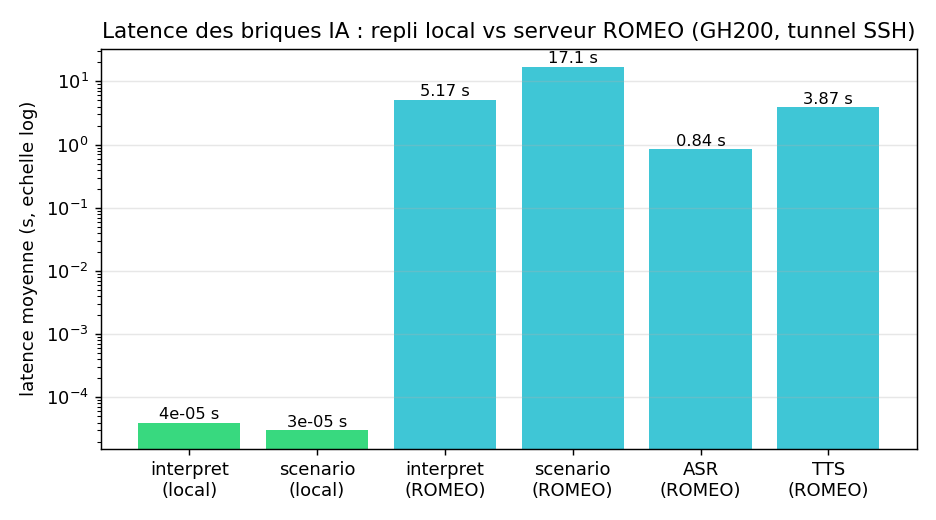
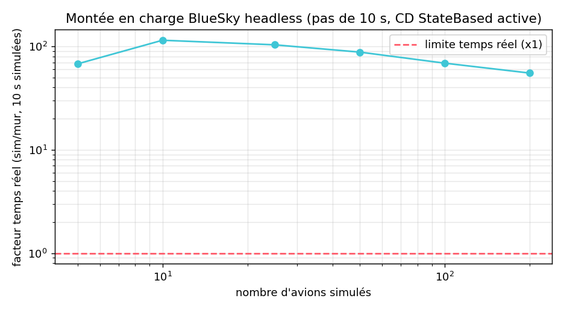
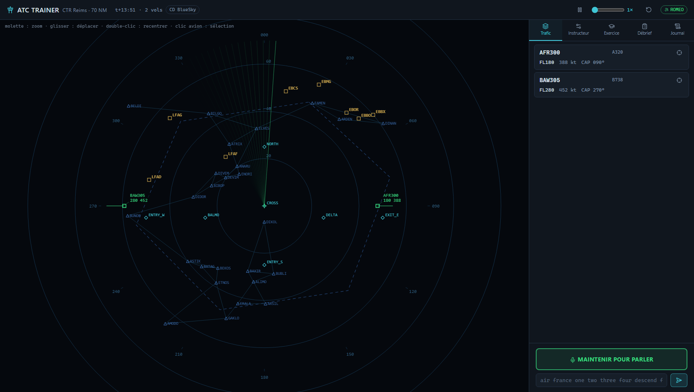

# Étude de performance, utilité et limites

Mesures réalisées le 2026-06-11 sur la configuration cible : application sur le
PC local (Windows, Python 3.12), backend IA sur le supercalculateur **ROMEO**
(nœud `armgpu` GH200, job SLURM `job_server.slurm`, accès par tunnel SSH).
Reproductible : `src\bluesky-env\Scripts\python.exe validation\05_performance.py`
(le volet ROMEO est ignoré automatiquement si le tunnel est fermé). Données
brutes : [`validation/results_perf.json`](../validation/results_perf.json).

## 1. Latence des briques IA — repli local vs ROMEO

| Brique | Local (hors-ligne) | ROMEO (GH200 + tunnel SSH) |
|---|---|---|
| Interprétation d'une clairance | **0,04 ms** (p95 : 0,05 ms, n = 200) | **5,2 s** en moyenne (0,98 – 8,4 s, n = 8, après chauffe) |
| Génération de situation | **0,03 ms** (n = 100) | **17,1 s** en moyenne (max 22,7 s, n = 2) |
| Reconnaissance vocale (ASR) | navigateur (Web Speech API, ~instantané) | **0,84 s** par message, **RTF 0,04** (≈ 25× plus rapide que le temps réel, n = 3) |
| Synthèse voix pilote (TTS) | navigateur (speechSynthesis, ~instantané) | **3,9 s** par collationnement, **RTF 0,82** (XTTS sur CPU, n = 3) |

Lecture :

- Le **mode local est temps réel** au sens strict : l'interprétation est ~10⁵ fois
  plus rapide que le LLM, pour une exactitude de 100 % sur la grammaire
  couverte ([VALIDATION.md](VALIDATION.md) § 4) — mais c'est une grammaire
  **fermée** (phraséologie standard EN/FR).
- Le **mode ROMEO** comprend des formulations libres (LLM + RAG ancré sur les
  fiches OACI, citations à l'appui), transcrit l'audio réel bruité avec le
  Whisper *fine-tuné* (WER 29,2 % sur ATCO2 contre 74,3 % zéro-shot, cf. S4) et
  répond avec une **voix de pilote clonée** dégradée VHF. Le coût est une
  latence de dialogue de l'ordre de **6 à 10 s par échange complet**
  (ASR 0,8 s + LLM ~5 s + TTS ~4 s, mesuré 17,4 s au premier échange, chargements
  compris) : adapté à un entraînement au rythme d'une fréquence réelle (un
  échange toutes les 10–30 s), pas à du tir rapide.
- Le tunnel SSH est négligeable dans le bilan (l'ASR fait l'aller-retour réseau
  + inférence en 0,84 s pour ~20 s d'audio).

## 2. Montée en charge du simulateur

| Avions simulés | 10 s simulées en (s mur) | Facteur temps réel |
|---|---|---|
| 5 | 0,148 | × 68 |
| 10 | 0,087 | × 115 |
| 25 | 0,097 | × 104 |
| 50 | 0,114 | × 88 |
| 100 | 0,145 | × 69 |
| 200 | 0,181 | × 55 |

BlueSky headless (détection de conflits StateBased active) tient **200 avions à
55× le temps réel** sur le PC local : la capacité du simulateur n'est jamais le
facteur limitant (un exercice en comporte 3 à 9, l'accélération ×10 de
l'interface reste donc sans risque). C'est cohérent avec la vectorisation
numpy de BlueSky — le coût croît lentement avec N (la CD est en O(N²) mais
vectorisée).

## 3. Utilité démontrée

1. **Entraînement autonome hors-ligne** : sans aucun serveur, un étudiant
   dispose d'un radar réaliste, de la phraséologie standard EN/FR (100 % sur le
   jeu de validation), du collationnement vocal navigateur et du **mode
   exercice noté** (conflits garantis mathématiquement, § 7 de VALIDATION.md).
2. **Immersion maximale avec ROMEO** : compréhension de formulations libres,
   audio réel bruité, voix pilote clonée — la boucle complète
   *voix → Whisper → Mistral+RAG → BlueSky → readback vocal* a été rejouée et
   vérifiée le 2026-06-11 (descente FL280 → FL180 exécutée et collationnée) :

   
3. **Sécurité multicouche prouvée** : bornes physiques (FL ≤ 450, vitesse
   ≤ 350 kt), waypoints validés par le graphe secteur, indicatif absent du
   radar = pas de réponse, et **garde-fou sémantique** : une transcription
   tronquée (« descend flight level one ») qui faisait halluciner un niveau au
   LLM est désormais **rejetée** (incohérence verbe/niveau détectée) au lieu de
   faire monter l'avion — cas réel reproduit puis bloqué pendant cette campagne.

## 4. Limites identifiées

- **Latence LLM** : ~5 s par clairance et ~17 s par génération de situation en
  mode ROMEO ; le mode exercice utilise donc la construction géométrique locale
  pour les conflits (instantanée et prouvée) et peut mélanger du trafic LLM.
- **Variance XTTS** : la synthèse est stochastique ; sur un même texte nous
  avons observé une génération propre (6,5 s) et une génération dégradée
  (9,8 s, fin avalée). Le RTF ~0,8 (CPU) interdit le streaming temps réel.
  Atténuation : garde-fous côté serveur + l'étudiant peut répéter.
- **ASR sur voix synthétique** : la boucle voix-clonée → Whisper cumule les
  erreurs des deux modèles (WER 22–24 % mesuré en S6/S8) ; avec un vrai micro
  et une voix humaine, le Whisper *fine-tuné* est nettement meilleur (6,7 % WER
  de validation sur UWB+ATCOSIM).
- **Génération de scénario LLM** : les caps proposés par Mistral ne sont pas
  toujours cohérents avec la direction d'arrivée (avion « venant du nord » avec
  cap 0) — le générateur local validé à 100 % reste la référence ; la sortie
  LLM est néanmoins normalisée et bornée par `_items_to_aircraft`.
- **Périmètre simulateur** : pas de gestion 4D complète (vent en altitude par
  couches unique, pas de profils SID/STAR), secteur unique centré Reims ;
  suffisant pour l'entraînement à la séparation en-route visé.

## 5. Coût d'exploitation

| Mode | Matériel requis | Coût marginal |
|---|---|---|
| Local | un PC portable (le venv BlueSky suffit) | nul |
| ROMEO | 1 GPU H100 (job SLURM 4 h, partition `short`) | quota cluster ; lancement en 1 commande (`start_romeo.ps1`), arrêt `start_romeo.ps1 -Cancel` |
