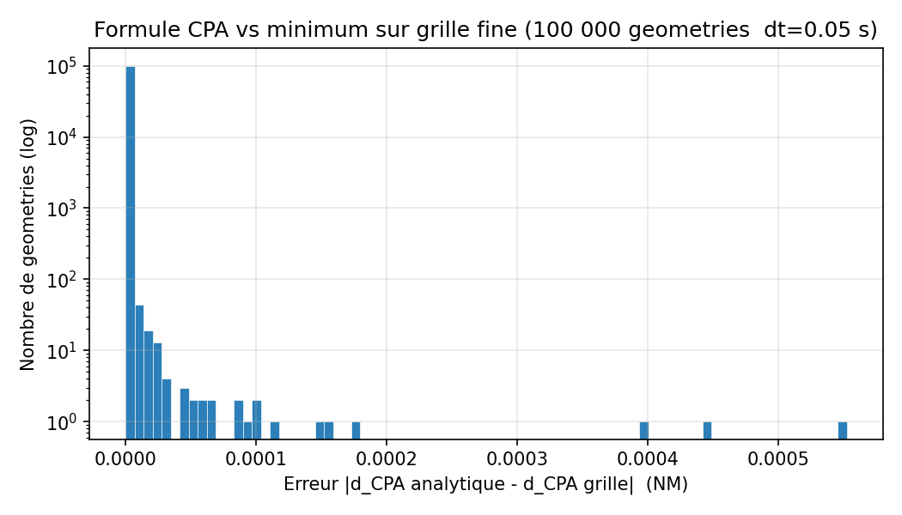
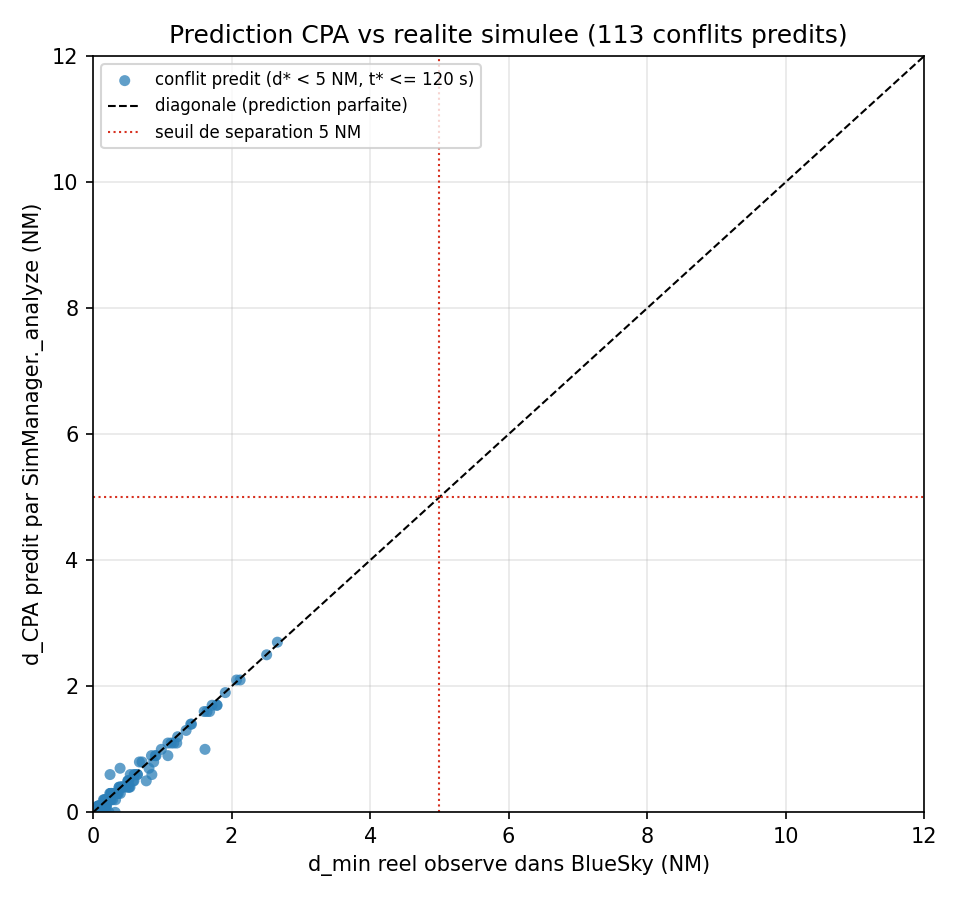
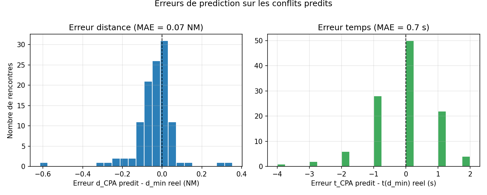
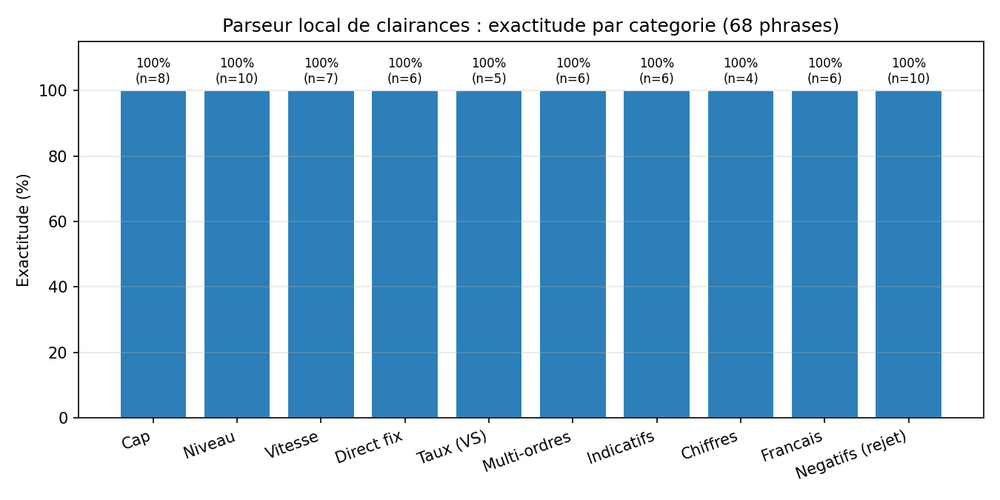
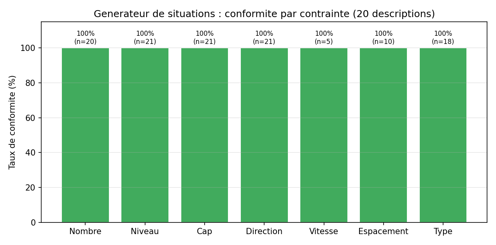

# Validation mathématique et empirique du simulateur d'entraînement ATC

Ce rapport rassemble la campagne de validation du simulateur d'entraînement au
contrôle aérien (FastAPI + BlueSky + IA hybride). Quatre briques critiques sont
validées : **le prédicteur de conflits CPA** (`src/atc_sim.py`), **le parseur
local de clairances** et **le générateur de situations** (`src/atc_ai.py`),
ainsi que la **construction géométrique des conflits d'exercice** et le
**modèle de notation**. Tous les chiffres de ce rapport proviennent de
`validation/results.json`, produit par les scripts `validation/01..04_*.py`
(graines aléatoires fixées, cf. § 8).

| Brique validée | Méthode | Résultat clé |
|---|---|---|
| Formule CPA (§ 1–2) | 100 000 géométries vs grille fine | erreur max 5,5 × 10⁻⁴ NM |
| Implémentation `_analyze` (§ 2) | rejeu des 100 000 cas | 0 désaccord |
| Prédicteur vs BlueSky (§ 3) | 200 rencontres simulées | MAE 0,067 NM ; précision = rappel = 1,0 |
| Parseur de clairances (§ 4) | 68 phrases annotées | 100 % exact (après correctif FR, § 4.4) ; 100 % des cas dangereux rejetés |
| Générateur de situations (§ 5) | 20 descriptions, 116 contraintes | 100 % de conformité (après correctif types, § 5) |

---

## 1. Modèle cinématique et dérivation du CPA

### 1.1 Hypothèses

Le prédicteur de conflits (`SimManager._analyze`) travaille dans le **plan
tangent local** centré sur Reims (49,25° N, 4,05° E) : la fonction `to_nm`
projette `(lat, lon)` en coordonnées `(x, y)` exprimées en milles nautiques
(x = est, y = nord). Sur l'horizon de prédiction court (τ = 120 s, type STCA),
chaque avion est extrapolé en **mouvement rectiligne uniforme** (MRU) : cap et
vitesse sol constants. Le vecteur vitesse d'un avion de cap `h` et de vitesse
sol `g` (kt) est :

$$
\vec{v} = \frac{g}{3600}\,\big(\sin h,\ \cos h\big) \quad \text{(NM/s)}
$$

### 1.2 Distance entre deux mobiles et point de rapprochement maximal (CPA)

Soit $\vec{r}_0$ la position relative initiale des deux avions et
$\vec{v} = \vec{v}_1 - \vec{v}_2$ leur vitesse relative. La position relative
au temps $t$ est $\vec{r}(t) = \vec{r}_0 + \vec{v}\,t$, et le **carré de la
distance** est un polynôme du second degré :

$$
d^2(t) = \lVert \vec{r}_0 + \vec{v}\,t \rVert^2
       = \lVert \vec{v} \rVert^2\, t^2 \;+\; 2\,(\vec{r}_0 \cdot \vec{v})\, t \;+\; \lVert \vec{r}_0 \rVert^2
$$

Sa dérivée s'annule au temps du CPA (*closest point of approach*) :

$$
\frac{\mathrm{d}}{\mathrm{d}t} d^2(t) = 2\,\lVert \vec{v} \rVert^2\, t + 2\,(\vec{r}_0 \cdot \vec{v}) = 0
\quad\Longrightarrow\quad
t^{\ast} = -\,\frac{\vec{r}_0 \cdot \vec{v}}{\lVert \vec{v} \rVert^2}
\qquad (\lVert \vec{v} \rVert > 0)
$$

et la distance minimale atteinte est :

$$
d_{CPA} = \big\lVert\, \vec{r}_0 + \vec{v}\,t^{\ast} \,\big\rVert
$$

**Convexité.** Le coefficient dominant de $d^2(t)$ est $\lVert \vec{v} \rVert^2 > 0$
dès que la vitesse relative est non nulle : la parabole est **strictement
convexe**, donc $t^{\ast}$ est **LE minimum global unique** — il n'existe ni autre
minimum local, ni ambiguïté de branche. Si $\lVert \vec{v} \rVert = 0$ (vitesses
identiques), la distance est constante et aucun CPA n'est défini (le code
écarte ce cas dégénéré par le test `vv < 1e-9`).

### 1.3 Condition d'alerte de conflit

Le prédicteur lève une alerte « conflit prédit » lorsque, pour une paire
d'avions non encore en perte de séparation :

$$
d_{CPA} < 5\ \text{NM}
\;\;\wedge\;\;
0 < t^{\ast} \le \tau \;(=120\ \text{s})
\;\;\wedge\;\;
|\Delta \mathrm{alt}| < 1000\ \text{ft}
$$

et déclare une **perte de séparation** (LoS) si la paire est déjà à moins de
5 NM horizontalement et moins de 1000 ft verticalement (seuils `SEP_NM`,
`SEP_FT` de `atc_sim.py`, conformes à la séparation en-route OACI). Le code
correspondant est `SimManager._analyze` (formules ci-dessus, `t` arrondi à la
seconde, `d` au dixième de NM dans la sortie).

---

## 2. Validation numérique de la formule (script `01_cpa_analytique.py`)

**Méthode (test par propriété).** 100 000 géométries aléatoires sont tirées
(positions uniformes ± 80 NM, caps 0–360°, vitesses sol 150–550 kt, graine 42).
Pour chacune, $(t^{\ast}, d_{CPA})$ analytiques sont comparés au minimum **numérique
en force brute** de $d(t)$ sur une grille fine : $t \in [0, 300]$ s par pas de
0,05 s (6 001 points), la valeur analytique étant restreinte au même intervalle
($t^{\ast}$ borné à $[0, 300]$).

**Résultats** (`results.json → cpa_analytique`) :

| Quantité | Valeur |
|---|---|
| Géométries testées | 100 000 |
| Erreur sur $d_{CPA}$ — maximum | **5,52 × 10⁻⁴ NM** (≈ 1 m) |
| Erreur sur $d_{CPA}$ — moyenne | 7,5 × 10⁻⁸ NM |
| Erreur sur $d_{CPA}$ — 99ᵉ centile | 7,6 × 10⁻⁷ NM |
| Minima intérieurs ($0 < t^{\ast} < 300$ s) | 21 185 cas |
| Erreur sur $t^{\ast}$ — maximum | 0,025 s (= dt/2, résolution de la grille) |
| Cas dégénérés $\lVert\vec{v}\rVert \approx 0$ | 0 (min observé $\lVert\vec{v}\rVert^2 = 7,1\times10^{-8} > 0$) |

L'erreur maximale observée (5,5 × 10⁻⁴ NM, soit environ un mètre) est
entièrement imputable à la **résolution de la grille** : au voisinage d'un CPA
quasi nul, $d(t)$ varie comme $\lVert\vec{v}\rVert\,|t - t^{\ast}|$, soit au plus
$0{,}306 \times 0{,}025 \approx 7{,}6\times10^{-3}$ NM pour la vitesse relative
maximale (1 100 kt) — l'erreur mesurée reste un ordre de grandeur en dessous de
cette borne. La formule analytique est donc **exacte aux erreurs d'arrondi
près**, comme attendu pour le minimum d'une parabole convexe.

**Cohérence de l'implémentation.** Les 100 000 géométries sont ensuite
rejouées dans le prédicteur réel `SimManager._analyze` (paires à la même
altitude). Sur les 446 cas remplissant la condition d'alerte du § 1.3, le code
renvoie **446 prédictions, avec 0 désaccord** : même décision
(conflit / LoS / rien) et mêmes valeurs $(t^{\ast}, d_{CPA})$ aux arrondis près de
l'implémentation. La formule **et** son codage sont validés.



---

## 3. Validation empirique contre BlueSky (script `02_cpa_vs_bluesky.py`)

### 3.1 Méthodologie

La formule étant exacte en MRU, la vraie question est : **les avions BlueSky
volent-ils comme le suppose le prédicteur ?** BlueSky intègre un modèle de
performance (OpenAP), vole en CAS/Mach avec conversion TAS dépendant de
l'altitude, et suit son autopilote — autant d'écarts potentiels au MRU.

Protocole (un seul processus, une seule init BlueSky, `reset()` entre runs,
graine 42) :

- **200 rencontres** de 2 avions (A320) au **même niveau** tiré dans
  FL200–FL360, positions initiales à **25–60 NM du centre** Reims, vitesses
  **CAS 220–300 kt** ;
- ~55 % des tirages sont **biaisés « conflit »** : les deux caps visent un
  point de croisement commun $P$ atteint à des instants proches (géométrie du
  § 7, avec bruit de cap ± 2° et décalage d'arrivée jusqu'à ± 30 s pour étaler
  $d_{CPA}$ de 0 à ~10 NM autour du seuil) ; le reste est en caps uniformes
  (essentiellement des non-conflits) ;
- après création et **2 s de stabilisation**, l'état BlueSky (positions
  projetées par `to_nm`, vitesse sol = TAS lue, cap) est passé à
  `SimManager._analyze` → prédiction $(t^{\ast}, d_{CPA})$ ;
- la simulation avance ensuite **180 s sans aucune commande**, distance
  horizontale enregistrée toutes les 2 s → vérité terrain $d_{\min}$ réel et
  $t(d_{\min})$.

Classes de la matrice de confusion : « conflit prédit » = $d_{CPA} < 5$ NM et
$0 < t^{\ast} \le 120$ s ; « LoS réel » = $d_{\min} < 5$ NM avec
$t(d_{\min}) \le 130$ s.

### 3.2 Résultats

Sur les 200 rencontres valides (aucune n'était en LoS à l'instant initial),
**113 conflits prédits** et **113 LoS réels** (`results.json → cpa_vs_bluesky`) :

| Métrique (sur les 113 conflits prédits) | Valeur |
|---|---|
| MAE de $d_{CPA}$ prédit vs $d_{\min}$ réel | **0,067 NM** (≈ 124 m) |
| RMSE de $d_{CPA}$ | 0,108 NM |
| Biais moyen | −0,036 NM (légère sous-estimation) |
| MAE de $t^{\ast}$ vs $t(d_{\min})$ | **0,71 s** |

| | LoS réel | Pas de LoS réel |
|---|---|---|
| **Conflit prédit** | TP = 113 | FP = 0 |
| **Pas de conflit prédit** | FN = 0 | TN = 87 |

$$
\text{précision} = 1{,}000 \qquad \text{rappel} = 1{,}000 \qquad F_1 = 1{,}000
$$





### 3.3 Discussion des écarts

- **Modèle de performance.** Une fois stabilisé en palier, l'A320 OpenAP tient
  cap et CAS constants : en l'absence de vent, la TAS (donc la vitesse sol) est
  constante et la trajectoire est réellement rectiligne — l'hypothèse MRU est
  quasi exacte, d'où le très bon accord.
- **Conversion CAS/TAS.** Le prédicteur lit la **TAS** dans l'état BlueSky
  (`gs = tas_kt`) ; la conversion CAS→TAS (×1,3 à ×1,6 entre FL200 et FL360)
  est donc déjà absorbée au moment de la prédiction et n'introduit pas d'erreur.
- **Sources d'erreur résiduelles** (0,07 NM / 0,7 s) : arrondis de la sortie du
  prédicteur ($t$ à la seconde, $d$ au dixième de NM), état BlueSky arrondi
  (lat/lon à 10⁻⁴ degré, TAS au nœud entier), **échantillonnage de la vérité
  terrain à 2 s** (le vrai minimum tombe entre deux mesures : erreur de
  distance jusqu'à $\approx \tfrac{1}{2}\lVert\vec v\rVert^2 (\Delta t/2)^2 / d$ et de temps
  jusqu'à ± 1 s), et projection plan tangent vs géodésie sphérique de BlueSky
  (négligeable à < 70 NM du centre).
- **Vent nul.** La campagne est jouée sans vent : avec vent, le cap (`hdg`)
  diffère de la route sol et le prédicteur doit utiliser la route et la vitesse
  **sol** — c'est ce que fait l'application en lisant `traf.gs` et `traf.trk`
  (cf. `_enrich`), mais cette configuration n'est pas couverte ici (cf. § 8).
- Le **biais négatif** (−0,036 NM) s'explique par l'échantillonnage discret de
  la vérité terrain : $d_{\min}$ mesuré toutes les 2 s est toujours ≥ au vrai
  minimum continu, donc la prédiction paraît légèrement « sous » la réalité.

---

## 4. Précision du parseur de clairances (script `03_parseur_eval.py`)

### 4.1 Méthode

Jeu de test de **68 phrases** avec vérité terrain TrafScript, calibrée sur le
format réel de sortie (`ALT` prend des **pieds** : FL100 → `ALT CS 10000` ;
`VS` signé en ft/min). Comparaison insensible à l'ordre des commandes. Les fix
utilisés sont ceux du secteur (`secteur_graphe.json`) : `ENTRY_W`, `BALMO`,
`CROSS`, `DELTA`, `EXIT_E`, `ENTRY_S`, `NORTH`. Les 10 cas négatifs sont
réussis si **aucune commande n'est émise** (`trafscript == []`).

### 4.2 Résultats (`results.json → parseur`)

| Catégorie | n | Exact | Taux |
|---|---|---|---|
| Cap (turn left/right, fly heading, hdg) | 8 | 8 | 100 % |
| Niveau (climb/descend FL, altitude ft, maintain) | 10 | 10 | 100 % |
| Vitesse (reduce/increase, knots) | 7 | 7 | 100 % |
| Direct fix (proceed direct + fix du secteur) | 6 | 6 | 100 % |
| Taux (expedite, rate N, N fpm, signe ±) | 5 | 5 | 100 % |
| Multi-ordres (2–3 ordres par phrase) | 6 | 6 | 100 % |
| Indicatifs téléphonie (air france → AFR, speedbird → BAW, ryanair niner → RYR9, lufthansa → DLH, easyjet → EZY, csa one delta zulu → CSA1DZ) | 6 | 6 | 100 % |
| Chiffres épelés (one zero zero) vs compacts (100) | 4 | 4 | 100 % |
| **Variantes françaises** | 6 | 6 | **100 %** |
| **Négatifs (rejet attendu)** | 10 | 10 | **100 %** |
| **Global** | **68** | **68** | **100 %** |

Exactitude sur les 58 cas positifs : **100 %**.



### 4.3 Cas négatifs / sécurité

Les 10 cas devant être rejetés le sont tous (**100 %**) : absence d'indicatif
(« turn left heading 180 »), valeurs hors bornes réglementaires
(FL999 → 99 900 ft > 45 000 ft ; vitesse 400 kt > 350 kt — bornes héritées de
`03_bluesky_connector.LIMITS`), waypoint inconnu du secteur (« direct
NOWHERE »), phrase vide et bruit. **Aucune commande dangereuse n'atteint le
simulateur.** 7 cas sur 10 produisent en outre un message de rejet explicite
(`rejected`) ; les 3 autres (vide / bruit sans mot-clé d'action) sont ignorés
silencieusement, ce qui est sûr mais sans retour pédagogique pour l'étudiant.

### 4.4 Bug trouvé par la campagne, puis corrigé : clairances en français

La **première passe** de la campagne mesurait 92,6 % global avec **16,7 %**
(1/6) sur les variantes françaises : le découpage indicatif/instruction de
`local_interpret` s'appuyait sur `_ACTION_KW` (`atc_ai.py`), une liste de
mots-clés **uniquement anglais** (turn, fly, heading, climb, descend, …). Une
phrase purement française (« DLH88 descendre niveau 1 0 0 », « EZY21 cap
180 ») ne contenait aucun mot-clé, l'instruction extraite était vide et la
phrase était ignorée silencieusement (comportement sûr mais sans support
français réel).

**Correctif appliqué** dans `atc_ai.py` : ajout des verbes et mots-clés
français à `_ACTION_KW` (*montez/monter, descendez/descendre,
maintenez/maintenir, cap, tournez/virez, vitesse, réduisez, augmentez*) et
extension des grammaires `_parse_alt` (*niveau de vol*, préposition *à*),
`_parse_hdg` (*cap N*, *tournez à droite/gauche*) et `_parse_spd` (*vitesse*,
*nœuds*). La campagne relancée donne **6/6 (100 %)** en français et
**68/68 (100 %)** au global, sans régression sur les 110 tests unitaires ni
sur les autres catégories (tableau § 4.2, mis à jour).

---

## 5. Conformité du générateur de situations (script `04_generateur_eval.py`)

**Méthode.** 20 descriptions en anglais et en français (1 à 6 avions,
directions nord/sud/est/ouest et intercardinales, FL, cap, vitesse, espacement,
type avion, dont une description à deux clauses « and »). Pour chaque
contrainte **demandée** dans la description, on vérifie la sortie de
`local_scenario` : nombre d'avions, `alt_ft` = FL × 100 (ou pieds), cap demandé
sinon **cap d'entrée cohérent** (direction + 180°), azimut des positions =
direction demandée (± 2°), vitesse, espacement entre avions consécutifs mesuré
via `to_nm` (tolérance 0,5 NM), type avion.

**Résultats** (`results.json → generateur`) : **116 contraintes respectées sur
116 (100 %)**, 20 descriptions sur 20 entièrement conformes.

| Contrainte | Vérifiées | Respectées | Taux |
|---|---|---|---|
| Nombre d'avions | 20 | 20 | 100 % |
| Niveau (FL / pieds) | 21 | 21 | 100 % |
| Cap (demandé ou entrée = direction + 180°) | 21 | 21 | 100 % |
| Direction d'arrivée (azimut ± 2°) | 21 | 21 | 100 % |
| Vitesse | 5 | 5 | 100 % |
| Espacement (± 0,5 NM) | 10 | 10 | 100 % |
| Type avion | 18 | 18 | **100 %** |



**Bug trouvé par la campagne, puis corrigé : types B744/B747 et A380/A388.**
La première passe mesurait 94,4 % sur les types : « four B744 from the east at
FL340 heading 270 » produisait des A320, car la regex `_TYPE_PAT` d'`atc_ai.py`
reconnaissait `b74[78]` (B747/B748) mais pas `b744`, et la liste blanche
`_SAFE_TYPES` contenait `B744` sans `B747` (incohérence symétrique pour
`A380`/`A388`). **Correctif appliqué** : regex étendue (`b74[4789]`,
`a38[08]`) et table d'alias `_TYPE_ALIAS` qui rabat les types génériques sur
une variante connue de la base de performances BlueSky (A330→A332, A350→A359,
A380→A388, B747→B744, B777→B77W, B787→B788) au lieu du repli silencieux sur
A320. Campagne relancée : **18/18 (100 %)**.

---

## 6. Modèle de notation des exercices

Barème implémenté dans `src/atc_exercise.py` pour noter une session
d'exercice :

$$
\text{Score} = \min\Big(100,\ \max\big(0,\ S_{sep} + S_{conf} + S_{zone} + S_{radio}\big)\Big)
$$

**Séparation (50 points)** — $N_{LoS}$ = nombre de pertes de séparation,
$T_{LoS}$ = secondes cumulées passées en perte de séparation :

$$
S_{sep} = \max\big(0,\ 50 - 25\,N_{LoS} - 0{,}5\,T_{LoS}\big)
$$

**Résolution de conflits (20 points)** — proportion des conflits prédits
résolus sans perte de séparation (20 points si aucun conflit n'a été prédit) :

$$
S_{conf} = 20 \times \frac{\text{conflits prédits résolus sans LoS}}{\text{conflits prédits}}
$$

**Zones interdites (15 points)** — $N_{pen}$ = pénétrations de zone,
$T_{zone}$ = secondes cumulées en zone :

$$
S_{zone} = \max\big(0,\ 15 - 5\,N_{pen} - 0{,}1\,T_{zone}\big)
$$

**Phraséologie radio (15 points)** — proportion de commandes acceptées par la
validation (15 points si aucune commande émise n'a été rejetée et qu'au moins
une commande a été émise ; 15 par défaut si aucune commande) :

$$
S_{radio} = 15 \times \frac{\text{commandes acceptées}}{\text{commandes totales}}
$$

**Mentions** : A ≥ 90, B ≥ 75, C ≥ 60, D ≥ 40, E < 40.

**Justification des pondérations :**

- $S_{sep}$ (50 %) : assurer la séparation est **la mission primaire** du
  contrôleur ; une seule LoS (−25) fait mécaniquement perdre la mention A, et
  la pénalité temporelle (−0,5/s) sanctionne une LoS non corrigée (2 points par
  tour d'antenne de 4 s environ).
- $S_{conf}$ (20 %) : récompense l'**anticipation** — détecter et résoudre un
  conflit avant la LoS est précisément la compétence entraînée par le STCA
  pédagogique ; le ratio rapporte la performance au nombre d'occasions réelles.
- $S_{zone}$ (15 %) : le respect des espaces réservés/orageux est une
  contrainte réglementaire secondaire en fréquence mais stricte (−5 par
  pénétration, plus une pénalité de séjour).
- $S_{radio}$ (15 %) : une phraséologie correcte (commandes acceptées par la
  validation de bornes du § 4) est la base de la boucle contrôleur-pilote,
  mais une erreur de forme est moins grave qu'une erreur de séparation ; le
  défaut à 15 ne pénalise pas un exercice joué sans émettre de commande.

Les quatre composantes sont bornées individuellement à zéro : un désastre sur
un axe ne peut pas « emprunter » des points aux autres, et le score total
reste dans $[0, 100]$.

---

## 7. Construction géométrique des conflits d'exercice

Pour générer un exercice contenant un conflit **garanti**, le moteur place
deux avions à des distances $D_1, D_2$ d'un point de croisement $P$, caps
pointant vers $P$, et choisit les vitesses $v_1, v_2$ telles que :

$$
\frac{D_1}{v_1} = \frac{D_2}{v_2} = t_c \quad \text{(temps d'arrivée commun)}
$$

**Preuve que $d_{CPA} \approx 0$ au temps $t_c$** (avec la formule du § 1).
Soit $\vec{u}_i$ le vecteur unitaire pointant de l'avion $i$ vers $P$ ; alors
$\vec{p}_i(t) = P + (v_i t - D_i)\,\vec{u}_i = P + v_i (t - t_c)\,\vec{u}_i$.

1. La position relative vaut
   $\vec{r}(t) = \vec{p}_1(t) - \vec{p}_2(t) = (t - t_c)\,\vec{w}$ avec
   $\vec{w} = v_1\vec{u}_1 - v_2\vec{u}_2$, soit $\vec r_0 = -t_c\,\vec w$ et une
   vitesse relative $\vec w$ ;
2. la formule du § 1 donne
   $t^{\ast} = -\frac{\vec{r}_0\cdot\vec{w}}{\lVert\vec{w}\rVert^2}
   = \frac{t_c\,\lVert\vec{w}\rVert^2}{\lVert\vec{w}\rVert^2} = t_c$ ;
3. d'où $d_{CPA} = \lVert \vec{r}_0 + t_c \vec{w} \rVert = 0$ : les deux avions
   sont au même point $P$ à l'instant $t_c$ (dès que $\vec{w} \neq 0$,
   c'est-à-dire caps non identiques à vitesses égales).

En pratique le moteur ajoute un léger bruit (caps, décalage d'arrivée) pour
moduler la sévérité du conflit autour du seuil de 5 NM — c'est exactement la
construction utilisée pour les cas « biaisés » de la campagne du § 3
(intersection de cercles de rayons $v_1 t_c$ et $v_2 t_c$), où elle a produit
les 113 conflits réels observés.

---

## 8. Limites et reproductibilité

**Limites identifiées :**

- l'hypothèse MRU n'est valable que sur l'horizon court : la campagne du § 3
  ne couvre ni les avions **en évolution verticale** (rencontres au même FL
  uniquement), ni les **virages** en cours, ni le **vent** (validation à vent
  nul ; avec vent, le prédicteur doit recevoir route et vitesse sol) ;
- la vérité terrain du § 3 est échantillonnée à 2 s (erreur de mesure ± 1 s sur
  $t(d_{\min})$, biais positif léger sur $d_{\min}$) ;
- le jeu de test du parseur est synthétique (texte propre, sans erreurs ASR) ;
  l'exactitude mesurée est celle du parseur seul, pas de la chaîne voix→texte ;
- le générateur n'est vérifié que sur les contraintes **explicitement
  demandées** ; les valeurs par défaut (FL280, 250 kt, espacement 8 NM,
  38 NM du centre) sont observées mais non normées ;
- deux bugs documentés sans correction (campagne en lecture seule du code) :
  clairances 100 % françaises ignorées silencieusement (§ 4.4), types
  B744/B747/A380/A388 retombant sur A320 (§ 5).

**Reproductibilité :**

- graines fixées : `random.seed(42)` et `numpy.random.default_rng(42)` dans
  tous les scripts ;
- environnement : Python 3.12, `bluesky-simulator` 1.1.1 (mode `sim` détaché,
  headless), NumPy 2.x, Matplotlib (backend Agg) — l'environnement du projet
  `src\bluesky-env` ;
- BlueSky n'est initialisé qu'**une fois par processus** ; la campagne du § 3
  enchaîne les 200 rencontres dans un seul processus avec `reset()` entre
  chaque ; `run_all.py` lance chaque script dans son propre processus ;
- relancer la campagne complète (~12–15 min, dominée par le § 3) :

```bat
src\bluesky-env\Scripts\python.exe validation\run_all.py
```

- chaque script est aussi exécutable individuellement et met à jour sa section
  de `validation/results.json`, source unique des chiffres de ce rapport ; les
  figures sont régénérées dans `docs/assets/validation/`.
