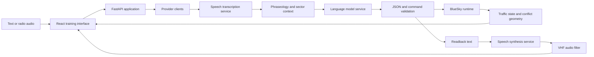

# Design and trade-offs

This document describes the checked-in implementation. The alternatives below
are engineering comparisons; no performance ranking is claimed without a
corresponding experiment.

## Data flow

The offline reference parser in `src/atc_ai.py` can be evaluated without the
model services. Its text corpus is the subject of the local accuracy report.
It does not stand in for a measured speech-to-command loop.

## Implementation choices

| Current implementation | Benefit and cost | Alternative to evaluate |
|---|---|---|
| OpenAI-compatible clients in `ai_client.py`, with a self-hosted facade in `server.py` | The application and model host have separate dependencies. HTTP transport and provider behavior become part of a full interaction. | Load all models inside the application process; compare memory use, isolation and actual end-to-end latency. |
| Phraseology documents and sector information supplied to prompt construction | The prompt has an inspectable local knowledge source. Passing context does not establish that the model follows it. | Retrieve a bounded subset from a separate index; measure command accuracy and failure categories on the same corpus. |
| Numeric bounds and waypoint checks after model parsing | Invalid output can be rejected before commands reach the simulator. Passing these checks does not prove that a clearance is appropriate for the traffic situation. | Add state-aware constraints, then validate on a separate scenario set. |
| Headless BlueSky through `bluesky_runtime.py` | The application reads traffic state and sends TrafScript commands through one integration layer. The runtime has process-level state and initialization costs. | Isolate each simulation in its own process when evaluating concurrent sessions. |
| Straight-line closest-approach calculation in `SimManager._analyze` | Relative motion gives an inexpensive local prediction. Turns, climbs and future route changes lie outside that calculation. | Compare route-aware or uncertainty-aware prediction on independently generated trajectories. |
| Separate radio filtering and readback construction | The same local audio treatment can be applied to several speech providers. A transcription-based intelligibility score still shares the judge model's errors. | Use held-out human listening and semantic checks alongside automatic metrics. |

## Inputs and retained research records

The annotated parser corpus combines development grammar examples and a harder
extension in `bench/bench_corpus.py`. The new campaign stores individual
predictions and failures so those strata remain visible. Treating their combined
accuracy as a general measure of language understanding would exceed the data.

The LoRA checkpoint and audio examples are intentional research inputs. Earlier
result JSON files and academic reports remain historical records. Duplicate
report images now refer to the canonical `docs/assets/` or `bench/figures/`
files. Generated web bundles and TypeScript build caches are excluded from Git;
installation therefore includes a frontend build before launching the app.

## Unresolved questions

Provider parity, full voice latency, held-out ASR accuracy and human usability
require separate measurements. The WSL report covers local parsing, geometry,
construction of example conflicts and the simulator workload that actually ran.
