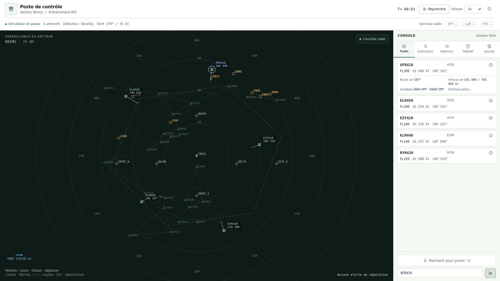

# Refonte du poste de contrôle et validation ROMEO

Validation du 27 septembre 2026, depuis `origin/main` (`9e987e8`). Le travail est isolé sur `codex/atc-flowbite-review`. Les rapports et benchmarks non commités de la copie locale d'origine ont été conservés. Usage visé : **grand écran**, avec contrôles en 1440 × 1000 et 1920 × 1080.



## Changements livrés

- Console claire, radar sombre, cinq panneaux métier conservés, contrôles clavier et libellés accessibles. Boutons et champs utilisent réellement Flowbite React 0.12.17 avec un thème commun. Les blocs premium n'ont pas été utilisés : Flowbite Blocks renvoyait HTTP 403 et aucune session authentifiée n'était disponible.
- État explicite de connexion, reconnexion nettoyée au démontage, détection d'un flux silencieux, panne du moteur visible et conservation d'une clairance dont l'envoi échoue.
- Diffusion WebSocket avec un writer et une file bornée par client. Un client bloqué est déconnecté sans bloquer les autres ; les événements et l'état initial passent par le même writer. Sérialisation JSON partagée entre destinataires.
- Snapshots profondément copiés ; traitement des commandes limité à 64 instructions ou 25 ms par tour. Les exceptions de commande et d'avancement sont journalisées et exposées au frontend.
- Repli géométrique corrigé : vitesse et route **sol**, mouvement vertical et intersection des fenêtres de séparation dans l'horizon de 120 s.
- Commandes BlueSky exécutées sans avancer artificiellement le temps. Avant correction, charger cinq avions pendant la pause faisait passer l'horloge de 0 à 0,6 s. L'initialisation à vide ne boucle plus sur 10 000 pas inutiles.
- Routes FMS, points actifs, CAS/TAS/GS, route sol, LNAV/VNAV et moteur de détection visibles. Couches radar réglables ; balayage décoratif désactivé par défaut. Le Canvas ne redessine que lorsque son état change ou qu'une animation est demandée.
- Chargement différé du débrief, nettoyage des ressources microphone/audio, validations HTTP renforcées et CI couvrant désormais l'API et le frontend.

Le premier essai navigateur avec un serveur démarré à froid a révélé une page blanche : la trame initiale omettait `predicted`. Le serveur fournit maintenant une liste vide et le client reste compatible avec l'ancienne trame. Deux tests de régression et le parcours navigateur réel couvrent cette correction.

## Résultats vérifiés

Toutes les installations, compilations et exécutions de tests ont eu lieu sur des **nœuds de calcul ROMEO**, via SLURM. Le login a servi aux transferts, à Git et à la lecture des résultats. Aucun GPU n'a été réservé pour cette campagne CPU.

| Vérification | Résultat | Job SLURM |
|---|---|---|
| Référence Python | 205 tests réussis | `722737_0` |
| Suite Python finale | **224 tests réussis** ; Ruff sans erreur | `722784` |
| Hooks et ressources audio | **8 tests Vitest réussis** | `722784` |
| Interface Chromium avec API déterministe | **3 tests réussis**, 3 workers simultanés ; deux tailles de bureau | `722784` |
| Navigateur + FastAPI + BlueSky réels | **1 parcours réussi** : démarrage, scénario, vent, pause/reprise, sélection et reset | `722784` |
| Livraison visuelle finale | Build et même parcours réel réussis après déplacement de la légende du vent pour éviter son chevauchement avec l'aide clavier | `722785` |
| BlueSky, 20/100/250/1 000 avions × 3 graines | **12 simulations réussies**, 150 s simulées chacune | `722768_0` à `_11` |
| API et WebSocket réels | **360 lectures**, 12 lecteurs HTTP et 16 clients WS simultanés, 20 états par client | `722768_12` |

La matrice contient 15 tâches, avec **4 tâches simultanées au maximum**. Chaque simulation possède son propre répertoire BlueSky (`ATC_BLUESKY_WORKDIR`) et sa propre graine : 7, 19 ou 41. Les contrôles vérifient les commandes HDG/ALT/SPD, une route FMS, le moteur de conflits natif, le vent, la turbulence, les zones, des états JSON finis, le nombre d'avions et le reset sans dérive d'horloge.

Les tests de client lent utilisent un transport contrôlé pour forcer les timeouts et la saturation de file. Les connexions de la campagne API utilisent de vrais sockets. Cela ne simule pas les pertes et délais d'un réseau WAN.

### Mesures de charge

Un CPU par tâche, 2 Go réservés. Chaque mesure de pas comprend 5 secondes de physique BlueSky **et** la production du snapshot. Les plages ci-dessous couvrent les trois graines ; 30 mesures par simulation.

| Avions | Médiane du pas de 5 s | Médiane d'une copie d'état | P95 d'une copie d'état |
|---:|---:|---:|---:|
| 20 | 43,83–46,73 ms | 0,26–0,28 ms | 0,28–0,29 ms |
| 100 | 55,27–55,70 ms | 1,28–1,31 ms | 1,33–1,39 ms |
| 250 | 97,27–98,04 ms | 4,05–4,16 ms | 4,78–53,58 ms |
| 1 000 | 922,62–932,24 ms | 37,25–39,24 ms | 122,84–129,38 ms |

Pour l'API : médiane **16,68 ms**, P95 **99,16 ms**, maximum **246,66 ms**, sur le réseau local du nœud pendant la charge concurrente. Pour `722768_9`, SLURM mesure 98,7 % d'utilisation du CPU réservé et 462,4 Mo de mémoire maximale. Le job frontend complet `722784` mesure 1 103,2 Mo au maximum avec Chromium et le serveur.

À 1 000 avions, la copie profonde et les nombreuses paires de conflits pèsent nettement. Ces résultats confirment la stabilité des cas exécutés ; **ils ne garantissent ni 60 images/s à 1 000 avions, ni le temps réel à vitesse ×20, ni une endurance de plusieurs heures**. Les copies atteignent aussi ponctuellement environ 63 ms à 250 avions. Pour augmenter cette échelle, la prochaine optimisation mesurable est un état immuable partagé et un traitement différentiel des paires, avec des profils CPU et une campagne longue.

### Chargement de l'interface

Le JavaScript initial passe de **609,17 ko à environ 323,71 ko** (186,68 → 98,16 ko gzip), soit environ **47 % de moins au chargement initial**. Le débrief ajoute 361,16 ko à sa première ouverture. Il s'agit d'un chargement différé : le total JavaScript des deux morceaux est supérieur à l'ancien fichier unique, notamment avec Flowbite. Les fichiers compilés de `frontend/dist` sont livrés pour conserver le lancement sans Node.js.

## Couverture de BlueSky

Vérification fondée sur le runtime installé **bluesky-simulator 1.1.1** et les champs réellement produits, en complément de la [documentation BlueSky](https://github.com/TUDelft-CNS-ATM/bluesky/wiki).

| Capacité | Intégration et limites |
|---|---|
| Mouvement, HDG/ALT/SPD, vitesses air/sol | Moteur BlueSky réel ; commandes vérifiées par la campagne, données rendues dans les strips et le radar. |
| Routes FMS et LNAV | Route, noms de points, point actif et état de guidage exposés ; ADDWPT/LNAV exécutés dans la campagne. |
| VNAV | État exposé ; la campagne ne valide pas toutes les contraintes de descente ni les procédures SID/STAR. |
| Conflits et pertes de séparation | Détection native activée, horizon 120 s, 5 NM / 1 000 ft ; repli géométrique explicite en cas d'indisponibilité. La résolution automatique n'est pas pilotée par cette interface. |
| Vent et turbulence | Appliqués au moteur ; dérive et distinction GS/CAS/TAS visibles. |
| Zones | Cercles/polygones BlueSky et détection de pénétration. Les cellules « orage » sont des zones pédagogiques, sans physique météorologique locale complète. |
| Base de navigation | Aéroports, points, routes et fixes du secteur affichés. Pas d'éditeur complet des procédures et de la base mondiale. |
| Scénarios et GUI native | Scénarios métier conservés. L'export `.scn` ouvre une simulation indépendante ; ce n'est pas une synchronisation bidirectionnelle. La GUI Qt n'a pas été testée sur les nœuds sans affichage. |
| Modèles de performances et plugins | Aucun nouveau sélecteur de modèles/plugins. BADA n'est pas disponible dans cet environnement ; BlueSky charge son modèle legacy. |

Cette interface expose donc le périmètre utile à l'entraînement actuel, **pas l'intégralité des commandes et plugins de BlueSky**. Les évolutions suivantes peuvent être livrées séparément : édition structurée des routes et contraintes, chargement de scénarios `.scn` planifiés, sélection explicite des modèles/plugins autorisés, analyse verticale des trajectoires et campagnes longues à forte densité.

Les fournisseurs **STT/LLM/TTS réels n'étaient pas disponibles aux anciens chemins ROMEO**. La gestion des erreurs, la capture et la libération des ressources audio sont testées ; aucune nouvelle mesure de qualité ou de latence d'inférence vocale n'est revendiquée. Les résultats historiques de modèles du projet restent distincts de cette campagne.

## Reproduire

Versions principales : Python 3.12.5, BlueSky 1.1.1, NumPy 2.5.3, FastAPI 0.141.1, Node 22.23.3, Flowbite React 0.12.17, Vite 6.4.3, Vitest 5.0.2, Playwright 1.63.0. Le [relevé Python exact](../validation/results/romeo-2026-09-27/python-environment.txt), les [13 résultats JSON](../validation/results/romeo-2026-09-27) et `frontend/package-lock.json` conservent les données et dépendances.

Sur un nœud de calcul, après création de `.venv` à la racine :

```bash
.venv/bin/python -m pip install -r validation/requirements-campaign.txt
cd frontend
npm ci
npx playwright install chromium
cd ..
```

Pour retrouver les versions Python exactes de cette campagne, installer le relevé de versions à la place du fichier de dépendances de campagne. Les bibliothèques système nécessaires à Chromium doivent être fournies par l'environnement de calcul.

Depuis la racine du dépôt sur ROMEO, avec Node dans le `PATH` (ou `NODE_BIN`) et `PLAYWRIGHT_BROWSERS_PATH` configuré si nécessaire :

```bash
sbatch --account=<votre-compte> validation/romeo_campaign.slurm
```

Le script ne partage pas de fichier de paramètres modifiable entre soumissions. Ne pas modifier le checkout pendant un tableau de tests ; employer un checkout distinct pour une autre révision. Les sorties vont dans `reports/romeo-<job>/` et les captures navigateur dans `frontend/test-results/`. Une exécution Playwright efface les anciennes captures de ce dernier répertoire : archiver les preuves avant de relancer.

Commandes ciblées, toujours sur un nœud de calcul :

```bash
.venv/bin/python validation/romeo_campaign.py sim --aircraft 100 --seed 7 --output reports/sim.json
.venv/bin/python validation/romeo_campaign.py api --output reports/api.json
cd frontend
npm run build
npm test
npm run test:e2e
npx playwright test --config=playwright.live.config.ts
```

## Limites du MCP remontées

- [romeo-mcp #3 — isoler le fichier de paramètres de chaque tableau SLURM](https://github.com/Gotman08/romeo-mcp/issues/3) : deux soumissions dans le même répertoire réutilisent `parametres.txt`.
- [romeo-mcp #4 — service interactif HTTP personnalisé et tunnel géré](https://github.com/Gotman08/romeo-mcp/issues/4) : le service `uvicorn` est refusé par l'outil interactif actuel ; le test visuel a utilisé un job et un tunnel SSH temporaires, ensuite arrêtés.
- [romeo-mcp #5 — corriger le témoin stderr de job_output](https://github.com/Gotman08/romeo-mcp/issues/5) : un fichier d'erreur vide peut être signalé comme contenant une erreur à cause de l'en-tête de restitution.

Référence d'intégration des composants : [Flowbite React / Vite](https://flowbite-react.com/docs/guides/vite).
